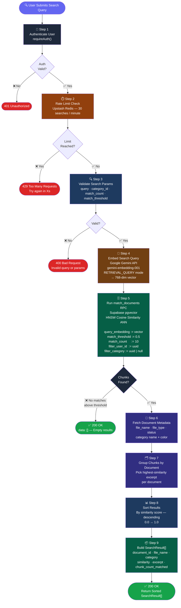

# VaultIQ

> **"Upload anything. Find everything."**
> Intelligent document management powered by AI-driven semantic search.

[](https://nextjs.org/)
[](https://react.dev/)
[](https://www.typescriptlang.org/)
[](https://supabase.com/)
[](https://js.langchain.com/)
[](https://tailwindcss.com/)
[](./LICENSE)


---

## Overview

**VaultIQ** is a full-stack AI-powered document vault and semantic search platform. Upload PDF, DOCX, TXT, or Markdown files — VaultIQ automatically parses, chunks, and embeds them using Google Gemini's `gemini-embedding-001` model. Retrieve exactly what you need using natural-language queries powered by **pgvector** cosine similarity search in Supabase.

It is designed to eliminate the frustration of keyword-based document search by understanding the *meaning* of your query, not just literal word matches.

---

## Table of Contents

- [Features](#features)
- [Architecture Overview](#architecture-overview)
- [Tech Stack](#tech-stack)
- [Project Structure](#project-structure)
- [How It Works](#how-it-works)
  - [Document Ingestion Pipeline](#document-ingestion-pipeline)
  - [Semantic Search Pipeline](#semantic-search-pipeline)
- [API Reference](#api-reference)
- [Database Schema](#database-schema)
- [Authentication & Security](#authentication--security)
- [Rate Limiting](#rate-limiting)
- [Getting Started](#getting-started)
  - [Prerequisites](#prerequisites)
  - [Environment Variables](#environment-variables)
  - [Local Development](#local-development)
  - [Database Setup](#database-setup)
- [Use Cases](#use-cases)
- [License](#license)

---

## Features

- 📁 **Multi-format Support** — Upload PDF, DOCX, DOC, TXT, and Markdown files (up to 50 MB)
- 🤖 **AI-Powered Semantic Search** — Natural language search using Google Gemini embeddings and pgvector ANN (HNSW)
- 🗂️ **Category Management** — Organize documents into custom color-coded categories; filter search by category
- 📄 **In-browser Document Viewer** — View PDFs via blob URLs, download DOCX, render plain text/markdown inline
- 🔐 **Auth-gated Access** — Supabase Auth with email/password; protected routes via Next.js Middleware
- 🛡️ **Row Level Security (RLS)** — All data is strictly scoped to the authenticated user at the database level
- ⚡ **Upload Queue with Live Status** — Drag-and-drop uploader with real-time per-file progress and processing polling
- 🔄 **Rate Limiting** — Per-user rate limits on upload and search via Upstash Redis
- 🌑 **Dark / Light Mode** — Full theme support via `next-themes` and Tailwind CSS v4
- 🔒 **Production Security Headers** — HSTS, CSP, X-Frame-Options, Permissions-Policy and more
- 🧹 **Environment Validation** — Zod-powered boot-time validation of all environment variables

---

## Tech Stack

| Layer | Technology |
|---|---|
| **Framework** | Next.js 16.1.6 (App Router, RSC) |
| **Language** | TypeScript 5 |
| **UI** | React 19, Tailwind CSS v4, shadcn/ui, Radix UI |
| **State Management** | Zustand v5, TanStack React Query v5 |
| **Forms** | React Hook Form + Zod validation |
| **Authentication** | Supabase Auth (email/password) |
| **Database** | Supabase (PostgreSQL 17 + pgvector extension) |
| **Storage** | Supabase Storage (private bucket with signed URLs) |
| **AI Embeddings** | Google Gemini `gemini-embedding-001` (768-dim) |
| **LangChain** | `@langchain/core`, `@langchain/textsplitters`, `@langchain/community` |
| **Document Parsing** | `pdf-parse` (PDF), `mammoth` (DOCX), native (TXT/MD) |
| **Rate Limiting** | Upstash Redis + `@upstash/ratelimit` |
| **Icons** | Lucide React |
| **Notifications** | Sonner (toast) |
| **Linting** | ESLint 9 (Next.js + TypeScript config) |

---

## Project Structure

```
vaultiq/
├── app/
│   ├── (auth)/                        # Auth route group
│   │   ├── login/                     # Login page + form
│   │   ├── register/                  # Registration page + form
│   │   └── forgot-password/           # Password recovery
│   ├── (dashboard)/                   # Protected dashboard group
│   │   ├── upload/                    # File upload + document list
│   │   ├── search/                    # Semantic search UI
│   │   └── documents/[id]/            # In-browser document viewer
│   ├── api/
│   │   ├── ingest/                    # POST — parse, embed, store document
│   │   ├── search/                    # POST — vector similarity search
│   │   ├── documents/                 # GET — list documents
│   │   │   └── [id]/
│   │   │       ├── route.ts           # DELETE document
│   │   │       └── view/              # GET signed URL for viewer
│   │   └── categories/                # GET/POST/PATCH/DELETE categories
│   ├── layout.tsx                     # Root layout + font + metadata
│   ├── page.tsx                       # Root redirect (auth-aware)
│   ├── error.tsx                      # Global error boundary
│   └── not-found.tsx                  # 404 page
│
├── components/
│   ├── layout/                        # Sidebar, MobileHeader, Providers, PageHeader
│   ├── upload/                        # DropzoneUploader, UploadQueueItem, DocumentCard, CategorySelector
│   ├── search/                        # SearchBar, SearchResults, CategoryFilter
│   ├── categories/                    # CategoryManager, CategoryForm
│   ├── shared/                        # FormField, AlertMessage, LoadingButton, CategoryBadge, ErrorBoundary
│   └── ui/                            # shadcn/ui primitives (Button, Dialog, Skeleton, etc.)
│
├── hooks/
│   ├── useUpload.ts                   # Upload queue state (Zustand)
│   ├── useDocuments.ts                # TanStack Query — document list
│   ├── useCategories.ts               # TanStack Query — CRUD categories
│   └── useSearch.ts                   # Debounced search with immediate trigger
│
├── lib/
│   ├── actions/
│   │   └── auth.actions.ts            # Server actions: login, register, logout
│   ├── langchain/
│   │   ├── embeddings.ts              # GeminiEmbeddings (RETRIEVAL_DOCUMENT + RETRIEVAL_QUERY)
│   │   ├── loaders.ts                 # LangChain document loaders (PDF, DOCX, TXT, MD)
│   │   └── splitter.ts                # RecursiveCharacterTextSplitter config
│   ├── utils/
│   │   ├── api-guard.ts               # requireAuth() — used in all API routes
│   │   ├── api-response.ts            # successResponse() / errorResponse() helpers
│   │   ├── rate-limit.ts              # Upstash Redis rate limiter setup
│   │   ├── file-helpers.ts            # buildStoragePath, getFileExtension
│   │   ├── logger.ts                  # Structured logger
│   │   └── cn.ts                      # clsx + tailwind-merge
│   ├── validations/
│   │   ├── auth.schema.ts             # Login + Register Zod schemas
│   │   ├── document.schema.ts         # Upload validation schema
│   │   ├── category.schema.ts         # Category create/update schema
│   │   └── search.schema.ts           # Search query + params schema
│   └── env.ts                         # Boot-time env var validation (Zod)
│
├── supabase/
│   ├── server.ts                      # createClient() for server components
│   ├── admin.ts                       # supabaseAdmin (service role key)
│   ├── config.toml                    # Supabase local dev config
│   └── migrations/
│       ├── 001_enable_pgvector.sql
│       ├── 002_categories_table.sql
│       ├── 003_documents_table.sql
│       ├── 004_document_chunks_table.sql
│       └── 005_match_documents_rpc.sql
│
├── types/
│   ├── database.types.ts              # Auto-generated Supabase types
│   ├── app.types.ts                   # SearchResult, UploadQueueItem, ApiResponse
│   └── pdf-parse.d.ts                 # Type shim for pdf-parse
│
├── constants/                         # APP_NAME, file types, limits, bucket name
├── middleware.ts                      # Auth guard + route redirect logic
├── next.config.ts                     # Security headers, serverExternalPackages, webpack
├── components.json                    # shadcn/ui config
├── tsconfig.json
└── package.json

```


---

## How It Works

### Document Ingestion Pipeline

When a user uploads a file, the following pipeline runs server-side in `/api/ingest`:

```mermaid
flowchart TD
    START(["📤 User Uploads File"])

    START --> A["🔐 Step 1\nAuthenticate User\nrequireAuth()"]

    A --> A_FAIL{"Auth\nValid?"}
    A_FAIL -- "❌ No" --> ERR1(["401 Unauthorized"])
    A_FAIL -- "✅ Yes" --> B

    B["⏱️ Step 2\nRate Limit Check\nUpstash Redis — 10 uploads / hour"]
    B --> B_FAIL{"Limit\nReached?"}
    B_FAIL -- "❌ Yes" --> ERR2(["429 Too Many Requests\nTry again in Xs"])
    B_FAIL -- "✅ No" --> C

    C["📋 Step 3\nParse FormData\nExtract File + category_id"]
    C --> D

    D["🔍 Step 4\nValidate File\nType: PDF · DOCX · DOC · TXT · MD\nSize: ≤ 50 MB"]
    D --> D_FAIL{"Valid?"}
    D_FAIL -- "❌ No" --> ERR3(["400 Bad Request\nInvalid type or size"])
    D_FAIL -- "✅ Yes" --> E

    E["☁️ Step 5\nUpload Raw File\nSupabase Storage Bucket — Private"]
    E --> F

    F["🗃️ Step 6\nInsert Document Row\nstatus: 'processing'"]
    F --> G

    G["📁 Step 7\nWrite File to /tmp\nFor LangChain Loaders"]
    G --> H

    H["📖 Step 8\nParse Document Content"]

    H --> H1["PDF\npdf-parse"]
    H --> H2["DOCX / DOC\nmammoth"]
    H --> H3["TXT / MD\nNative fs"]

    H1 & H2 & H3 --> I

    I["✂️ Step 9\nChunk Text\nRecursiveCharacterTextSplitter\nLangChain"]
    I --> J

    J["🤖 Step 10\nEmbed Chunks\nBatches of 100 → Google Gemini API\ngemini-embedding-001 · 768-dim\nRETRIEVAL_DOCUMENT mode"]
    J --> K

    K["💾 Step 11\nInsert Chunk Rows\ncontent + vector 768 → document_chunks\nSupabase pgvector"]
    K --> L

    L{"All Chunks\nProcessed?"}
    L -- "✅ Success" --> M["✅ Step 12\nUpdate Document Status\n→ 'ready'"]
    L -- "❌ Error" --> N["❌ Step 12\nUpdate Document Status\n→ 'failed'\n+ error_message"]

    M --> O["🧹 Step 13\nClean Up /tmp File"]
    N --> O

    O --> DONE(["🎉 Ingestion Complete\nDocument searchable via pgvector"])

    style START fill:#6366f1,color:#fff
    style DONE fill:#16a34a,color:#fff
    style ERR1 fill:#dc2626,color:#fff
    style ERR2 fill:#dc2626,color:#fff
    style ERR3 fill:#dc2626,color:#fff
    style A fill:#1e293b,color:#fff
    style B fill:#92400e,color:#fff
    style C fill:#1e3a5f,color:#fff
    style D fill:#1e3a5f,color:#fff
    style E fill:#065f46,color:#fff
    style F fill:#065f46,color:#fff
    style G fill:#1e293b,color:#fff
    style H fill:#312e81,color:#fff
    style H1 fill:#3b1f6e,color:#fff
    style H2 fill:#3b1f6e,color:#fff
    style H3 fill:#3b1f6e,color:#fff
    style I fill:#312e81,color:#fff
    style J fill:#713f12,color:#fff
    style K fill:#065f46,color:#fff
    style L fill:#1e293b,color:#fff
    style M fill:#14532d,color:#fff
    style N fill:#7f1d1d,color:#fff
    style O fill:#334155,color:#fff

```


<hr style="border: none; border-top: 1px solid #e2e8f0;" />


### Semantic Search Pipeline
When a user submits a query in `/search`, the following pipeline runs server-side in `/api/search`:


---
## API Reference

All responses follow a consistent envelope shape:

```typescript
{ data: T;      error: null   }  // success
{ data: null;   error: string }  // failure
```

### Endpoints

| Method | Endpoint | Description | Auth |
|--------|----------|-------------|------|
| `POST` | `/api/ingest` | Upload and process a document | ✅ Required |
| `POST` | `/api/search` | Semantic vector search | ✅ Required |
| `GET` | `/api/documents` | List all user documents | ✅ Required |
| `DELETE` | `/api/documents/:id` | Delete document + chunks + storage file | ✅ Required |
| `GET` | `/api/documents/:id/view` | Get signed URL (60 min) for document viewer | ✅ Required |
| `GET` | `/api/categories` | List all user categories | ✅ Required |
| `POST` | `/api/categories` | Create a new category | ✅ Required |
| `PATCH` | `/api/categories/:id` | Update category name or color | ✅ Required |
| `DELETE` | `/api/categories/:id` | Delete a category | ✅ Required |

---

### Search Request Body

```json
{
  "query": "What are the key financial risks?",
  "category_id": "optional-uuid-or-null",
  "match_count": 10,
  "match_threshold": 0.5
}
```

| Field | Type | Required | Description |
|-------|------|----------|-------------|
| `query` | `string` | ✅ Yes | Natural language search query |
| `category_id` | `string \| null` | ❌ No | Filter results to a specific category |
| `match_count` | `number` | ❌ No | Max number of results to return (default: `10`) |
| `match_threshold` | `number` | ❌ No | Minimum cosine similarity score (default: `0.5`) |

### Search Response

```json
{
  "data": [
    {
      "document_id": "uuid",
      "file_name": "annual-report-2024.pdf",
      "category": {
        "id": "uuid",
        "name": "Finance",
        "color": "#22c55e"
      },
      "similarity": 0.87,
      "excerpt": "The primary financial risk factors include...",
      "chunk_count_matched": 3
    }
  ],
  "error": null
}
```

| Field | Type | Description |
|-------|------|-------------|
| `document_id` | `string` | UUID of the matched document |
| `file_name` | `string` | Original uploaded filename |
| `category` | `object \| null` | Category metadata if assigned |
| `similarity` | `number` | Cosine similarity score `0.0 – 1.0` |
| `excerpt` | `string` | Best matching chunk text |
| `chunk_count_matched` | `number` | Total chunks matched for this document |

---

## Database Schema

### `categories`

| Column | Type | Notes |
|--------|------|-------|
| `id` | `UUID` | Primary key |
| `user_id` | `UUID` | FK → `auth.users` (CASCADE DELETE) |
| `name` | `TEXT` | Unique per user |
| `color` | `TEXT` | Hex color code (e.g. `#22c55e`) |
| `created_at` | `TIMESTAMPTZ` | Auto-set on insert |

### `documents`

| Column | Type | Notes |
|--------|------|-------|
| `id` | `UUID` | Primary key |
| `user_id` | `UUID` | FK → `auth.users` (CASCADE DELETE) |
| `category_id` | `UUID` | FK → `categories` (SET NULL on delete) |
| `file_name` | `TEXT` | Original uploaded filename |
| `file_type` | `TEXT` | `pdf` · `docx` · `doc` · `txt` · `md` |
| `file_size` | `INTEGER` | File size in bytes |
| `storage_path` | `TEXT` | Supabase Storage object path |
| `chunk_count` | `INTEGER` | Total embedded chunks |
| `status` | `ENUM` | `processing` · `ready` · `failed` |
| `error_message` | `TEXT` | Populated on failure, `null` otherwise |

### `document_chunks`

| Column | Type | Notes |
|--------|------|-------|
| `id` | `BIGSERIAL` | Primary key |
| `document_id` | `UUID` | FK → `documents` (CASCADE DELETE) |
| `user_id` | `UUID` | FK → `auth.users` |
| `category_id` | `UUID` | Denormalized for category-filtered search |
| `content` | `TEXT` | Raw chunk text content |
| `metadata` | `JSONB` | `{ file_name, chunk_index, page_number }` |
| `embedding` | `vector(768)` | Gemini 768-dim embedding vector |

---

### `match_documents` RPC

A PostgreSQL function using **HNSW (Hierarchical Navigable Small World)** indexing with cosine distance for fast Approximate Nearest Neighbor (ANN) search across all user document chunks.

```sql
SELECT * FROM match_documents(
  query_embedding    := <vector>,      -- 768-dim query vector from Gemini
  match_threshold    := 0.5,           -- minimum cosine similarity score
  match_count        := 10,            -- max rows to return
  filter_user_id     := <uuid>,        -- RLS-safe user scoping
  filter_category_id := <uuid | null>  -- optional category filter
);
```

| Parameter | Type | Description |
|-----------|------|-------------|
| `query_embedding` | `vector(768)` | Embedded search query from Gemini `RETRIEVAL_QUERY` mode |
| `match_threshold` | `float` | Minimum similarity — chunks below this score are excluded |
| `match_count` | `integer` | Maximum number of chunks to return |
| `filter_user_id` | `uuid` | Scopes search to the authenticated user's chunks only |
| `filter_category_id` | `uuid \| null` | When provided, restricts results to a specific category |


---

## Authentication & Security

VaultIQ uses a multi-layer security model:

- **Supabase Auth** — Email/password authentication with session cookies managed via `@supabase/ssr`
- **Next.js Middleware** — Centralized route guard that redirects unauthenticated users to `/login` and preserves the `?next=` redirect destination
- **Row Level Security (RLS)** — Every database table enforces `auth.uid() = user_id` policies, so users can only ever access their own data — even if API logic is bypassed
- **`requireAuth()`** — A server-side utility used in every API route handler to validate the session before processing any request
- **Security Headers** — `Content-Security-Policy`, `Strict-Transport-Security`, `X-Frame-Options: SAMEORIGIN`, `X-Content-Type-Options: nosniff`, and `Permissions-Policy` applied globally via `next.config.ts`
- **Environment Validation** — All required env vars are validated with Zod at boot time; the app throws and refuses to start if anything is missing

---

## Rate Limiting

Rate limits are enforced per user via Upstash Redis:

| Action | Limit |
|---|---|
| Document Upload (`/api/ingest`) | 10 uploads / hour |
| Semantic Search (`/api/search`) | 30 searches / minute |

Exceeded limits return HTTP `429` with a human-readable retry message:

```json
{ "data": null, "error": "Too many uploads. Try again in 47s" }
```

---

## Getting Started

### Prerequisites

- Node.js 20+
- npm or pnpm
- A [Supabase](https://supabase.com/) project with the `pgvector` extension enabled
- A [Google AI Studio](https://aistudio.google.com/) API key (Gemini)
- An [Upstash Redis](https://upstash.com/) database

### Environment Variables

Create a `.env.local` file in the project root:

```text
# Supabase — Public
NEXT_PUBLIC_SUPABASE_URL=https://<your-project>.supabase.co
NEXT_PUBLIC_SUPABASE_ANON_KEY=<your-anon-key>

# Supabase — Server Only
SUPABASE_SERVICE_ROLE_KEY=<your-service-role-key>

# Google Gemini AI
GOOGLE_API_KEY=<your-google-api-key>

# Upstash Redis
UPSTASH_REDIS_REST_URL=https://<your-upstash>.upstash.io
UPSTASH_REDIS_REST_TOKEN=<your-upstash-token>

# App Config
NEXT_PUBLIC_APP_URL=http://localhost:3000
NEXT_PUBLIC_MAX_FILE_SIZE_MB=50
```

> ⚠️ The app will throw and refuse to start if any required variable is missing — this is intentional.

### Local Development

```bash
# 1. Clone the repository
git clone https://github.com/your-username/vaultiq.git
cd vaultiq

# 2. Install dependencies
npm install

# 3. Set up environment variables
cp .env.example .env.local
# Edit .env.local with your credentials

# 4. Start local Supabase (optional — or use cloud project)
npx supabase start

# 5. Run database migrations
npm run db:push

# 6. Start development server
npm run dev
```

Open [http://localhost:3000](http://localhost:3000) in your browser.

### Database Setup

Run migrations in order to initialize the full schema:

```bash
npm run db:push
```

To regenerate TypeScript types from your Supabase schema:

```bash
npm run db:types
```

> Requires the Supabase CLI and your project ID configured.

### Available Scripts

| Command | Description |
|---|---|
| `npm run dev` | Start development server (Turbopack) |
| `npm run build` | Build for production |
| `npm run start` | Start production server |
| `npm run lint` | Run ESLint |
| `npm run db:types` | Regenerate Supabase TypeScript types |
| `npm run db:push` | Push migrations to Supabase |

---

## Use Cases

VaultIQ is versatile and fits a wide range of document-heavy workflows:

- **Personal Knowledge Base** — Upload research papers, notes, and articles; search them by meaning rather than keywords
- **Legal Document Management** — Store contracts and agreements; query specific clauses across hundreds of files
- **HR & Onboarding** — Manage company policies, handbooks, and procedures; let team members find answers instantly
- **Research & Academia** — Organize papers by category (e.g., "Machine Learning", "Biology"); semantic search finds relevant content across dozens of PDFs
- **Financial Document Vault** — Upload reports, invoices, and statements; search for specific financial terms or figures
- **Content Teams** — Manage briefs, brand guidelines, and SOPs with full-text AI retrieval
- **Developer Docs Hub** — Upload API documentation and technical specs; query them in plain English

---

## License

This project is licensed under the [MIT License](./LICENSE).

---

<div align="center">

Built with ❤️ using Next.js, Supabase, and Google Gemini AI

</div>
